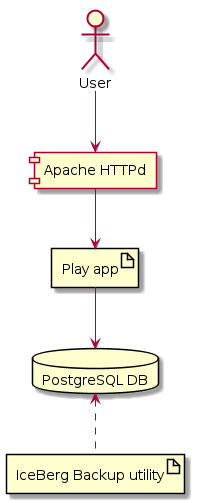

# HearUsPlatform Server Configuration

Click [here](http://hear-us.mbarsinai.com/) for the site. Click [here](setup.md) for installation and configuration steps.

## System Overview

* Apache [HTTPd](https://httpd.apache.org/) in front of a [Play](https://www.playframework.com/) app.
* Data stored in [PostgreSQL](https://www.postgresql.org/) database.
* Backup and restore with [IceBerg](https://github.com/hilel14/iceberg) backup utility.

